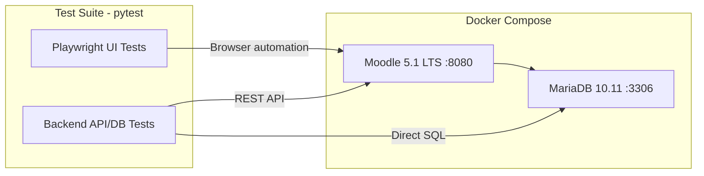
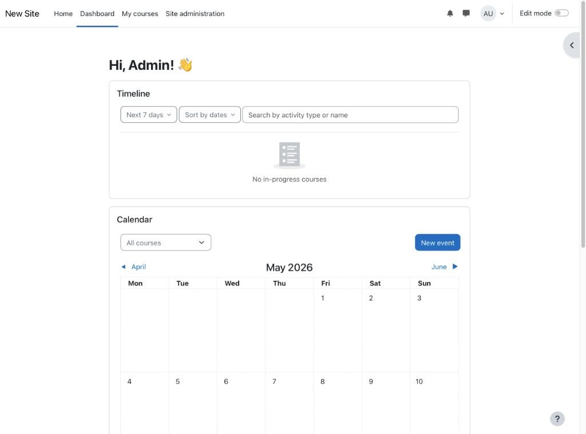
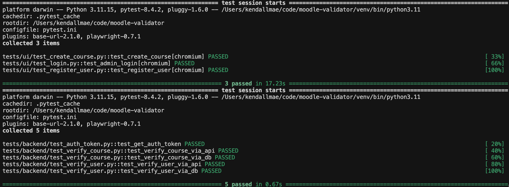

# Moodle Validator

Automated UI and backend test suite for a local Moodle instance. Uses Playwright for browser automation and pytest for test execution, verifying both frontend interactions and backend data integrity.

> **Branch:** `feature/moodle-5.1-lts` — Uses [Moodle 5.1 LTS](https://moodle.org) on PHP 8.2 with an automated CLI install. See `main` branch for the Bitnami legacy version (Moodle 5.0.1).

## Architecture



## Prerequisites

- Docker and Docker Compose
- Python 3.11+
- Node.js (required by Playwright for browser binaries)

## Quick Start

### 1. Start Moodle

```bash
docker compose up -d
```

The first launch takes **5–8 minutes** while the CLI installer sets up the database. Monitor progress:

```bash
docker compose logs -f moodle
```

You'll know it's ready when you see `Moodle install complete.` followed by `Starting Apache...`. Access the site at **[http://localhost:8080](http://localhost:8080)**.

**Default Admin Credentials:**
- **Username:** `user`
- **Password:** `AdminPass123!`

*Once Moodle is ready, log in with the credentials above. You should see the Dashboard:*



### 2. Install Python Dependencies

**macOS/Linux**

```bash
python3 -m venv venv
source venv/bin/activate
pip install -r requirements.txt
playwright install chromium
```

**Windows**

```powershell
python -m venv venv

# Git Bash
source venv/Scripts/activate

# PowerShell
.\venv\Scripts\Activate.ps1

pip install -r requirements.txt
playwright install chromium
```

### 3. Run the Test Suite

Run UI tests first (they create data that backend tests verify):

```bash
pytest tests/ui -v
pytest tests/backend -v
```

Or run everything together:

```bash
pytest tests/ui -v && pytest tests/backend -v
```

### Example Output



## Test Overview

### UI Tests (`tests/ui/`)

| Test | What it does |
| --- | --- |
| `test_login.py` | Logs into admin dashboard, verifies Dashboard loads |
| `test_create_course.py` | Creates a new course, verifies it appears |
| `test_register_user.py` | Registers a new user, verifies they show up in user list |

### Backend Tests (`tests/backend/`)

| Test | What it does |
| --- | --- |
| `test_auth_token.py` | Obtains a REST API token, validates its format |
| `test_verify_course.py` | Verifies course exists via REST API and direct DB query |
| `test_verify_user.py` | Verifies user exists via REST API and direct DB query |

## Stack Details

| Component | Version | Notes |
| --- | --- | --- |
| Moodle | 5.1.0 LTS | Latest long-term support release |
| PHP | 8.2 | Via `pasechnik/moodle_lts_images` |
| MariaDB | 10.11 | With utf8mb4 collation |
| Apache | 2.4 | Bundled in the Moodle image |

The `scripts/entrypoint.sh` handles automated setup:
1. Waits for MariaDB to be ready
2. Generates `config.php` on every startup
3. Runs the CLI database installer on first boot
4. Fixes file permissions for Apache
5. Starts Apache in the foreground

## Stopping and Cleaning Up

**Stop the environment (preserves data):**

```bash
docker compose down
```

**Wipe everything and start fresh:**

```bash
docker compose down -v
```

## Project Structure

```
moodle-validator/
├── docker-compose.yml      # Moodle 5.1 + MariaDB containers
├── scripts/
│   └── entrypoint.sh       # Automated Moodle CLI install
├── conftest.py             # Shared pytest fixtures
├── pytest.ini              # Pytest configuration
├── requirements.txt        # Python dependencies
├── docs/                   # Screenshots and assets
│   ├── moodle-dashboard.png
│   └── test-results.png
├── tests/
│   ├── ui/                 # Playwright browser tests
│   │   ├── test_login.py
│   │   ├── test_create_course.py
│   │   └── test_register_user.py
│   └── backend/            # API and database tests
│       ├── test_auth_token.py
│       ├── test_verify_course.py
│       └── test_verify_user.py
└── README.md
```
